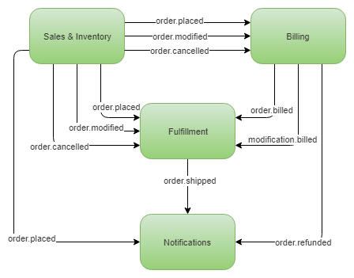

# Business Domain

Our example architecture has four services that interact via events.

The **Sales and Inventory** service emits three events:

- order.placed
- order.modified
- order.cancelled

The **Billing** service consumes those three events, 
and either charges the client or refunds the client, emitting:

- order.billed
- modification.billed
- order.refunded

The **Fulfillment** service consumes:

- order.placed
- order.modified
- order.cancelled
- order.billed
- modification.billed

When an `order.placed` event is received the shipment starts getting prepared. 
Only once an `order.billed event` is received does the shipment get shipped. 
If an `order.modification` is received and the shipment has not shipped yet, 
then it can be modified, else a new shipment starts getting prepared. 
Only once a modification has been billed can the shipment take place. 
If an `order.cancelled` event is received and the shipment has not shipped yet, 
then it is cancelled and the items returned to inventory.

The **Notifications** service simply sends email to the client on certain 
important events. Currently those are:

- order.placed
- order.shipped
- order.refunded
